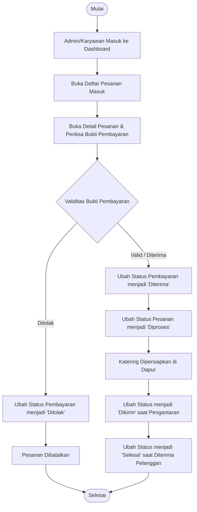
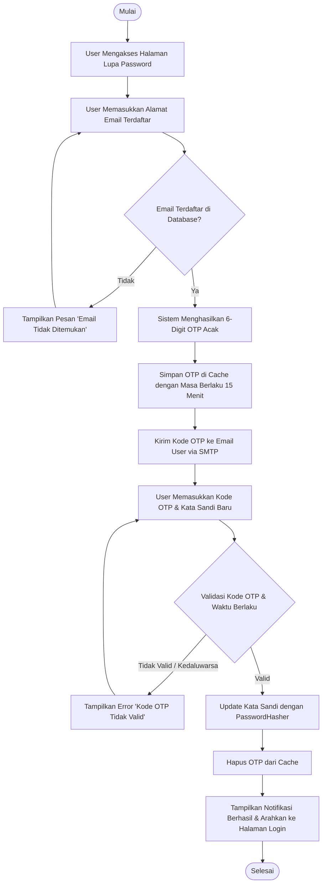
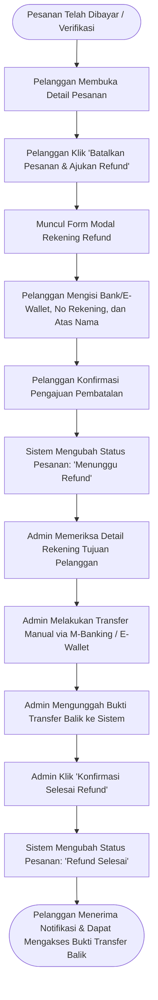

# CateringApp - Sistem Informasi Pemesanan Catering Berbasis Web & REST API

CateringApp adalah aplikasi Fullstack berbasis Web dan RESTful API untuk mengelola layanan katering secara terintegrasi. Aplikasi ini memfasilitasi pelanggan dalam melihat katalog makanan, memilih menu ke keranjang belanja (*cart*), melakukan *checkout*, mengunggah bukti pembayaran, serta memantau status pesanan secara *real-time*. Di sisi manajemen, aplikasi ini menyediakan hak akses berjenjang (Role-Based Access Control) bagi Pemilik Toko/Admin dan Karyawan untuk mengelola data menu, kategori, pesanan, verifikasi pembayaran, manajemen pengguna, serta laporan omset harian.

---

## 🚀 Fitur Utama

### 1. Autentikasi & Keamanan (Security)
* **JWT Authentication & Refresh Token**: Autentikasi aman berbasis JSON Web Token (Bearer) dengan fitur rotasi *refresh token*.
* **Role-Based Access Control (RBAC)**: Pemisahan hak akses antara Administrator/Pemilik Toko, Karyawan, dan Pelanggan.
* **Password Hashing**: Menggunakan algoritma aman `IPasswordHasher<T>` bawaan ASP.NET Core Identity.
* **Forgot Password & OTP via SMTP**: Pemulihan kata sandi menggunakan kode OTP 6-digit acak yang dikirimkan via email dengan masa berlaku 15 menit.
* **XSS & Security Headers**: Perlindungan terhadap XSS Injection, Clickjacking (`X-Frame-Options`), MIME-sniffing (`X-Content-Type-Options`), serta konfigurasi `Content-Security-Policy`.
* **SQL Injection Prevention**: Dilindungi melalui penggunaan Entity Framework Core parameterized query (LINQ).

### 2. Frontend & Pengalaman Pelanggan (Customer Area)
* **Katalog Menu Interaktif**: Menampilkan daftar paket katering dengan pencarian, filter kategori, dan paginasi.
* **Keranjang Belanja (Cart System)**: Pelanggan dapat menambahkan banyak menu sekaligus dengan catatan khusus per item sebelum *checkout*.
* **Checkout & Pesanan**: Pengisian data alamat pengiriman dan tanggal pengiriman katering.
* **Upload Bukti Pembayaran**: Mendukung unggah berkas bukti transfer dalam format Gambar (`.jpg`, `.jpeg`, `.png`, `.webp`) dan Dokumen (`.pdf`) dengan batasan ukuran 5 MB.
* **Pelacakan Status Pesanan**: Pelanggan dapat memantau status pesanan (`Pending`, `Diproses`, `Dikirim`, `Selesai`, `Dibatalkan`).

### 3. Manajemen Operasional & Laporan (Admin / Owner Area)
* **Dashboard Analitik**: Ringkasan total pesanan, total pendapatan, omset harian 7 hari terakhir, dan jadwal pengiriman.
* **Manajemen Master Data**: CRUD lengkap untuk Paket Menu, Kategori Menu, dan Data Pengguna.
* **Verifikasi Pembayaran**: Pratinjau bukti bayar (gambar dan dokumen PDF langsung di browser) serta validasi persetujuan/penolakan.
* **Soft Delete**: Data yang dihapus tidak langsung hilang dari database melainkan diberi timestamp `deleted_at` (berlaku pada Menu, Kategori, Pengguna, dan Pesanan).

### 4. RESTful API & Dokumentasi
* **Arsitektur REST API**: Menyediakan endpoint lengkap dengan kata kerja HTTP standar (`GET`, `POST`, `PUT`, `PATCH`, `DELETE`) dan status code (`200`, `201`, `400`, `401`, `403`, `404`, `422`, `500`).
* **Swagger / OpenAPI Documentation**: Dokumentasi interaktif yang dapat diakses langsung melalui `/swagger` untuk menguji seluruh endpoint dengan otentikasi JWT Bearer.
* **Global Error Handling**: Middleware seragam yang mengembalikan format JSON konsisten saat terjadi kesalahan validasi maupun kegagalan sistem.

---

## 🛠️ Teknologi yang Digunakan

* **Backend**: C# ASP.NET Core 8.0 (MVC & Web API)
* **ORM**: Entity Framework Core 8.0 (SQL Server Provider & Migrations)
* **Database**: Microsoft SQL Server
* **Frontend**: ASP.NET Core Razor Views (`.cshtml`), HTML5, Vanilla CSS3, JavaScript, Bootstrap 5, AdminLTE
* **Autentikasi**: JSON Web Token (JWT) & ASP.NET Core Identity Password Hasher
* **Dokumentasi API**: Swagger / Swashbuckle OpenAPI
* **Layanan Email**: SMTP Client (`System.Net.Mail`)

---

## 📁 Struktur Folder Proyek

```text
CateringApp/
├── Controllers/
│   ├── AccountController.cs       # Login, Register, Logout, Lupa Password & OTP
│   ├── CartController.cs          # Keranjang belanja dan Checkout
│   ├── DashboardController.cs     # Ringkasan operasional & statistik
│   ├── HomeController.cs          # Halaman beranda & error handler view/API
│   ├── KategoriMenuController.cs  # CRUD Kategori Menu (Admin)
│   ├── PaketMenuController.cs     # CRUD Paket Katering (Admin/Karyawan)
│   ├── PenggunaController.cs      # CRUD Manajemen User (Admin)
│   ├── PesananController.cs       # Pengelolaan pesanan & upload bukti bayar
│   └── Api/                       # Kumpulan RESTful API Controller
│       ├── AuthApiController.cs
│       ├── KategoriApiController.cs
│       ├── MenuApiController.cs
│       ├── PembayaranApiController.cs
│       ├── PenggunaApiController.cs
│       ├── PesananApiController.cs
│       └── UploadApiController.cs
├── Filters/
│   └── SessionAuthorizeAttribute.cs # Interceptor autentikasi JWT cookie & RBAC
├── Helpers/
│   ├── SessionExtensions.cs       # Serialisasi objek JSON ke Session
│   └── XssSanitizer.cs            # Sanitasi input dari script berbahaya
├── Middleware/
│   └── GlobalErrorHandlingMiddleware.cs # Global Exception Handling JSON API
├── Models/
│   ├── DTO/                       # Data Transfer Object untuk REST API & validasi
│   ├── Entity/                    # Class Entity EF Core (pemetaan tabel database)
│   └── ViewModel/                 # Model perantara untuk Razor Views
├── Services/
│   ├── Context/
│   │   ├── CateringDbContext.cs   # Konfigurasi EF Core & relasi tabel
│   │   └── DbInitializer.cs       # Seeder data awal (20 data per tabel)
│   ├── Impl/
│   │   ├── CateringService.cs     # Logika bisnis utama sistem
│   │   ├── EmailService.cs        # Pengiriman email OTP via SMTP
│   │   └── JwtTokenService.cs     # Pembuatan JWT token & refresh token
│   └── Interface/
├── Views/                         # Tampilan antarmuka Razor (.cshtml)
├── wwwroot/                       # Berkas statis publik (CSS, JS, gambar, uploads)
├── catering.sql                   # Skrip basis data SQL Server
├── CateringApp_Postman_Collection.json # Koleksi pengujian API Postman
├── Program.cs                     # Inisialisasi aplikasi, middleware, & dependency injection
└── appsettings.json               # Konfigurasi database, JWT, dan SMTP
```

---

## ⚙️ Cara Instalasi dan Menjalankan Aplikasi

### Prasyarat:
* [.NET 8.0 SDK](https://dotnet.microsoft.com/download/dotnet/8.0)
* [Microsoft SQL Server](https://www.microsoft.com/sql-server/) (LocalDB atau Express)
* SQL Server Management Studio (SSMS) atau Azure Data Studio (opsional)

### Langkah-langkah:
1. **Clone Repository**:
   ```bash
   git clone <URL_REPOSITORY_ANDA>
   cd CateringApp
   ```

2. **Setup Basis Data**:
   * Buka file `catering.sql` menggunakan SSMS atau Azure Data Studio, kemudian eksekusi script untuk membuat database `db_catering` beserta seluruh tabel dan 20 data awal (*seed data*).
   * Atau pastikan koneksi pada `appsettings.json` sudah sesuai dengan instance SQL Server lokal Anda:
     ```json
     "ConnectionStrings": {
       "DefaultConnection": "Server=localhost;Database=db_catering;Trusted_Connection=True;MultipleActiveResultSets=true;TrustServerCertificate=True"
     }
     ```

3. **Restore Dependency & Build**:
   ```bash
   dotnet restore
   dotnet build
   ```

4. **Jalankan Aplikasi**:
   ```bash
   dotnet run
   ```

5. **Akses Aplikasi Melalui Browser**:
   * Antarmuka Web: `https://localhost:7143` atau `http://localhost:5143`
   * Dokumentasi Swagger API: `https://localhost:7143/swagger`

---

## 👤 Akun Demo untuk Pengujian

Aplikasi telah dilengkapi dengan akun bawaan untuk mempermudah evaluasi:

| Peran (Role) | Username | Password | Email | Hak Akses |
| :--- | :--- | :--- | :--- | :--- |
| **Admin / Pemilik Toko** | `admin` | `admin123` | `admin@catering.com` | Akses penuh ke seluruh menu master, omset, laporan, dan verifikasi |
| **Admin / Pemilik Toko** | `owner` | `owner123` | `owner@catering.com` | Akses penuh operasional dan manajemen |
| **Karyawan / Staf** | `karyawan` | `karyawan123` | `karyawan@catering.com` | Mengelola menu dan memverifikasi pesanan pelanggan |
| **Pelanggan / Customer** | `budi` | `user123` | `budi@gmail.com` | Memesan menu katering, mengelola keranjang, unggah bukti bayar |
| **Pelanggan / Customer** | `siti` | `user123` | `siti@gmail.com` | Memesan menu katering, mengelola keranjang, unggah bukti bayar |

---

## 📊 Dokumentasi Perancangan Sistem (Flowchart)

### 1. Flowchart Alur Pemesanan Katering (Pelanggan)

```mermaid
flowchart TD
    A([Mulai]) --> B[Pelanggan Membuka Katalog Menu]
    B --> C{Pilih Menu Katering}
    C --> D[Tambahkan ke Keranjang Belanja]
    D --> E{Lanjut Belanja atau Checkout?}
    E -- Lanjut Belanja --> B
    E -- Checkout --> F[Periksa Rincian & Masukkan Alamat/Tanggal Pengiriman]
    F --> G{Konfirmasi Buat Pesanan}
    G --> H[Sistem Membuat Pesanan dengan Status 'Pending']
    H --> I[Unggah Bukti Pembayaran (JPG/PNG/WEBP/PDF)]
    I --> J[Sistem Menyimpan Berkas & Ubah Status Pembayaran 'Menunggu Verifikasi']
    J --> K([Selesai - Menunggu Verifikasi Admin])
```

### 2. Flowchart Alur Verifikasi & Pemrosesan Pesanan (Admin / Karyawan)



### 3. Flowchart Alur Pemulihan Kata Sandi (Forgot Password & OTP)



### 4. Flowchart Alur Pengembalian Dana (Refund Manual)

